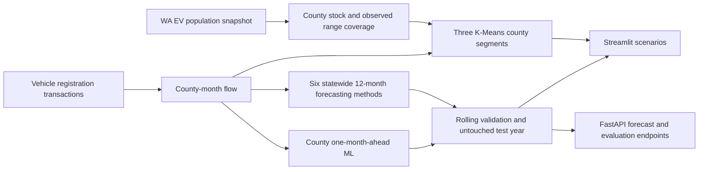

# ChargeForward: Washington EV analytics and forecasting

A reproducible data science project rebuilt from an ATOM x AIS Colab draft. It preserves the original **EV stock versus registration flow**, **range cleaning**, **linear and polynomial forecasts**, **200-mile scenario**, and **three county segments**. It adds a pooled county ML model, Gradient Boosting and Random Forest comparisons, chronological validation, an untouched test year, a Streamlit app, a FastAPI service, Docker, and automated tests.

> **Read the target carefully:** the registration dataset measures transactions, not new EV purchases. The project does not have a charger inventory, so it does not estimate charger supply or a 42% infrastructure gap.

## Results at a glance

| Measure | Result | Meaning |
|---|---:|---|
| Washington EVs in stock snapshot | **298,916** | Unique DOL vehicle IDs after state and county filtering |
| Counties analyzed | **39** | All Washington counties |
| Electric registration transactions | **576,457** | Sum across January 2017–July 2026; repeat transactions are possible |
| Electric transactions in latest 12 months | **124,834** | August 2025–July 2026 |
| Records with positive observed electric range | **103,142 / 298,916 (34.5%)** | The range analysis covers a minority of EV records |
| County-month examples in final ML test | **468** | 39 counties × 12 months |
| County ML final-test R² | **0.9076** | Random Forest selected on earlier validation; prior-year baseline scored **0.9436** |
| County clustering silhouette | **0.339** | Moderate separation of the three descriptive segments |

Data snapshot: supplied CSV files, analyzed September 16, 2026. See [data sources and definitions](#data-sources-and-definitions).


The blue series is observed registration activity. The dashed orange series is the model chosen on earlier rolling validation. Its final-year performance was weak, so the extension is an exploratory scenario.

## Modeling design



### 1. Statewide 12-month forecast

Six approaches compete: seasonal naive, linear regression, second-degree polynomial regression (the original notebook baseline), seasonal Ridge, Random Forest, and Histogram Gradient Boosting. Tree models use time, month seasonality, and the observed value 12 months earlier. Three expanding-window, 12-month folds select a model **before** the final August 2025–July 2026 test. The chosen model is then refit on all observed months for the August 2026–July 2027 projection.


| Model | Earlier mean RMSE ↓ | Final-test RMSE ↓ | Final-test R² | Final-test WAPE |
|---|---:|---:|---:|---:|
| Polynomial degree 2 **(selected on validation)** | **675.26** | 1,940.90 | -1.5171 | 15.64% |
| Random Forest | 1,583.03 | 1,306.94 | -0.1413 | 11.30% |
| Gradient Boosting | 1,772.33 | 1,372.13 | -0.2580 | 11.83% |
| Linear | 1,846.80 | 1,624.18 | -0.7626 | 13.76% |
| Seasonal Ridge | 1,853.16 | 1,619.25 | -0.7519 | 13.67% |
| Seasonal naive | 1,854.13 | **1,242.82** | **-0.0321** | **10.46%** |

**Interpretation:** the earlier folds favored a polynomial curve; the final test year did not. Even the best final-year R² is negative. A resume should describe the rigorous evaluation and regime-shift finding, not claim an accurate long-horizon production forecast.


### 2. County one-month-ahead model

A second task predicts each county's *next month* of electric transactions. Features are built from information available before that month: prior-month activity, prior-year activity, trailing averages, year-over-year difference, historical county scale, and calendar seasonality. Training ends July 2024; August 2024–July 2025 is validation; August 2025–July 2026 is the untouched test. The test has **468 county-month rows**. This one-month prediction task is separate from the 12-month forecast and assumes the model is updated as each month arrives.

| County-month model | Validation RMSE ↓ | Final-test RMSE ↓ | Final-test R² | Final-test WAPE |
|---|---:|---:|---:|---:|
| Random Forest **(selected on validation)** | **73.54** | 132.57 | 0.9076 | 16.98% |
| Histogram Gradient Boosting | 87.82 | 132.29 | 0.9080 | 17.87% |
| Prior-year month baseline | 157.10 | **103.59** | **0.9436** | **16.57%** |

The ML model has strong pooled R², partly because county sizes vary greatly. The simple baseline has lower error in the final year. The repository retains both results rather than presenting pooled R² alone as proof of superiority.


### 3. County segmentation and range scenario

K-Means groups the 39 counties using log EV stock, recent electric transaction volume, and the share of **measured** ranges below the selected threshold. Features are standardized; `k=3` preserves the original project's three market segments. Labels are assigned by each cluster's median EV stock, so **Growth** is a relative size label, not a claim that its growth rate is highest. The Streamlit slider refits clusters from 50 to 350 miles.

| Segment | Counties | EVs in stock | Electric transactions, latest 12 months | Median measured share below 200 miles |
|---|---:|---:|---:|---:|
| Emerging | 7 | 798 | 642 | 62.5% |
| Growth | 14 | 11,873 | 9,225 | 75.1% |
| Established | 18 | 286,245 | 114,967 | 68.3% |

Silhouette score: **0.339**. Segments help compare counties; they do not establish charging access, economic demographics, or policy need.


## Exploratory data analysis

The largest fleet is in King County, but recent electric transaction flow is relatively more distributed. Fleet stock and transactions measure different things and should not be added together.

| County | EV fleet | Electric transactions, latest 12 months | Positive range coverage | Measured share below 200 miles |
|---|---:|---:|---:|---:|
| King | 144,257 | 21,776 | 32.0% | 67.0% |
| Snohomish | 37,818 | 12,822 | 29.6% | 66.0% |
| Pierce | 25,042 | 16,658 | 36.0% | 70.1% |
| Clark | 18,782 | 15,175 | 37.3% | 72.4% |
| Thurston | 10,985 | 8,015 | 38.7% | 71.5% |
| Kitsap | 10,351 | 8,549 | 39.3% | 73.9% |


**Range data quality matters.** Zero range does not mean zero driving capability. The pipeline flags missing or zero values, estimates display ranges hierarchically by make/model/year → make/model → EV type → overall median, and computes threshold shares **only from positive observed ranges**.


The transaction history also has seasonality and a clear change in level over time. This is why a time-ordered test and a seasonal naive comparison matter.


## Run locally

Use Python 3.10+. Download the two linked CSVs below, or use the copies supplied with this project. Place them in `data/raw/` with the filenames shown. Raw and processed files are excluded from Git because they are large and updated by the source.

```bash
python -m venv .venv
source .venv/bin/activate
pip install -e '.[app,api,viz,test]'
python -m chargeforward.pipeline \
  --population 'data/raw/Electric Vehicle Population Data.csv' \
  --registrations 'data/raw/Vehicle Registrations by Class and County.csv'
python scripts/generate_figures.py
streamlit run chargeforward/dashboard.py
```

In a second terminal:

```bash
uvicorn chargeforward.api:app --reload
```

API routes: `/health`, `/counties`, `/forecast/{county}`, `/forecast/statewide`, `/evaluation`, and interactive docs at `/docs`. The dashboard offers county selection, forecasts, evaluation tables, a range-threshold slider, and a Folium segment map.

Run tests and package the API:

```bash
python -m unittest discover -s tests -v
docker build -t chargeforward .
docker run --rm -p 8000:8000 chargeforward
```

Build the processed artifacts before building the Docker image. The image serves the API on port 8000. GitHub Actions runs the test suite on every push and pull request.

## Data sources and definitions

| Source | Used for | Join / cleaning choice |
|---|---|---|
| [Electric Vehicle Population Data](https://catalog.data.gov/dataset/electric-vehicle-population-data) | EV fleet snapshot, model, range, location, BEV share | Filter `State == WA`, restrict to 39 WA counties, deduplicate DOL vehicle ID |
| [Vehicle Registrations by Class and County](https://catalog.data.gov/dataset/vehicle-registrations-by-class-and-county) | Monthly registration activity | Use **Residential County**, month of `Transaction Date`, `Fuel Type == Electric`, sum `Count` |

The registration file's `Electric` fuel code is used as provided; it is not separately labeled BEV versus PHEV. `Hybrid` is excluded from electric-flow forecasts. County map markers use median vehicle coordinates, not charger locations or county centroids. The API and dashboard read locally generated outputs; they do not claim live data ingestion.

## Repository layout

| Path | Purpose |
|---|---|
| `chargeforward/pipeline.py` | CSV ingestion, cleaning, imputation, county segments, outputs |
| `chargeforward/forecasting.py` | Six statewide 12-month methods and rolling backtest |
| `chargeforward/panel.py` | Pooled county one-month-ahead ML and baseline |
| `chargeforward/dashboard.py` | Streamlit exploration and interactive Folium map |
| `chargeforward/api.py` | FastAPI forecasts and evaluation |
| `scripts/generate_figures.py` | Rebuild the eight README charts from processed outputs |
| `data/processed/evaluation.json` | Local reproducible metrics after pipeline run |

## Resume-safe project description

> Built a reproducible Python pipeline joining **298,916 Washington EV records** with **576,457 electric registration transactions** across **39 counties**; engineered lag, seasonality, fleet, and measured-range features. Compared six statewide forecast methods with rolling time validation and a final test year, plus Random Forest and Gradient Boosting for **468 county-month one-month-ahead predictions**. Deployed results through FastAPI and Streamlit, with Docker and CI. The final county ML test achieved **R² 0.908**, while a prior-year baseline performed better on RMSE, motivating a transparent model-risk analysis.

The original draft's **42% charger gap**, **R² 0.85**, and competition or policy claims are not reproduced or independently verified by these files. Adding a dated charger inventory and geography would be required to estimate infrastructure coverage.
