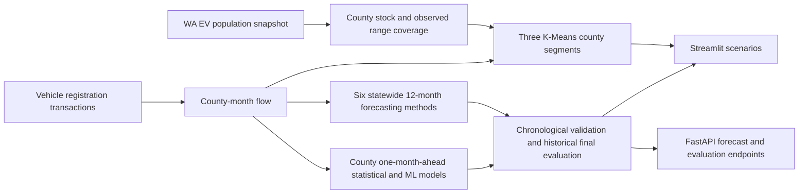

# ChargeForward: Washington EV analytics and forecasting

A reproducible data science project rebuilt from an ATOM x AIS Colab draft. It preserves the original **EV stock versus registration flow**, **range cleaning**, **linear and polynomial forecasts**, **200-mile scenario**, and **three county segments**. It adds Poisson and Negative Binomial count models, county ML, uncertainty intervals, feature ablation, chronological evaluation, a Streamlit app, a FastAPI service, Docker, and automated tests.

> **Read the target carefully:** the registration dataset measures transactions, not new EV purchases. The project does not have a charger inventory, so it does not estimate charger supply or a 42% infrastructure gap.

## Results at a glance

| Measure | Result | Meaning |
|---|---:|---|
| Washington EVs in stock snapshot | **298,916** | Unique DOL vehicle IDs after state and county filtering |
| Counties analyzed | **39** | All Washington counties |
| Electric registration transactions | **576,457** | Sum across January 2017–July 2026; repeat transactions are possible |
| Electric transactions in latest 12 months | **124,834** | August 2025–July 2026 |
| Records with positive observed electric range | **103,142 / 298,916 (34.5%)** | The range analysis covers a minority of EV records |
| County-month examples in historical final evaluation | **468** | 39 counties × 12 months |
| Best county-model RMSE | **92.95** | Poisson GLM; 103.59 for the prior-year baseline |
| County clustering silhouette | **0.339** | Moderate separation of the three descriptive segments |

Data snapshot: supplied CSV files, analyzed September 16, 2026. See [data sources and definitions](#data-sources-and-definitions).


The blue series is observed registration activity. The dashed orange series is the model chosen on earlier rolling validation. Its final-year performance was weak, so the extension is an exploratory scenario.

## Modeling design

**Questions this project investigates:** **RQ1 Predictability:** Can historical transactions predict next-month county activity? **RQ2 Complexity:** Do nonlinear ML models consistently beat seasonal and statistical baselines? **RQ3 Heterogeneity:** Where do errors differ across counties? **RQ4 Stability:** Do model rankings remain stable across years?



### 1. Statewide 12-month forecast

Six approaches compete: seasonal naive, linear regression, second-degree polynomial regression (the original notebook baseline), seasonal Ridge, Random Forest, and Histogram Gradient Boosting. Tree models use time, month seasonality, and the observed value 12 months earlier. Three expanding-window, 12-month folds select a model before the August 2025–July 2026 historical evaluation. The chosen model is then refit on all observed months for the August 2026–July 2027 projection. This final historical period was inspected in earlier project versions; it is not prospective data.


| Model | Earlier mean RMSE ↓ | Final-test RMSE ↓ | Final-test R² | Final-test WAPE |
|---|---:|---:|---:|---:|
| Polynomial degree 2 **(selected on validation)** | **675.26** | 1,940.90 | -1.5171 | 15.64% |
| Random Forest | 1,583.03 | 1,306.94 | -0.1413 | 11.30% |
| Gradient Boosting | 1,772.33 | 1,372.13 | -0.2580 | 11.83% |
| Linear | 1,846.80 | 1,624.18 | -0.7626 | 13.76% |
| Seasonal Ridge | 1,853.16 | 1,619.25 | -0.7519 | 13.67% |
| Seasonal naive | 1,854.13 | **1,242.82** | **-0.0321** | **10.46%** |

**Interpretation:** the earlier folds favored a polynomial curve; the final historical year did not. Even the best final-year R² is negative. A resume should describe the evaluation and model-ranking instability, not claim an accurate long-horizon production forecast.


### 2. County one-month-ahead model

A second task predicts each county's *next month* of electric transactions. Features are built from information available before that month: prior-month activity, prior-year activity, trailing averages, year-over-year difference, historical county scale, and calendar seasonality. Training ends July 2024; August 2024–July 2025 is validation; August 2025–July 2026 is the previously inspected historical final evaluation (**468 county-month rows**). The current EV fleet snapshot and range values are excluded from historical forecasts. This task assumes observed transactions are updated monthly.

| Model | Type | Validation RMSE ↓ | Final RMSE ↓ | Final MAE ↓ | Final WAPE ↓ | Final R² |
|---|---|---:|---:|---:|---:|---:|
| Prior-year month | Seasonal baseline | 157.10 | 103.59 | 44.20 | 16.57% | 0.9436 |
| **Poisson GLM** | Statistical | **42.73** | **92.95** | **31.20** | **11.70%** | **0.9546** |
| Negative Binomial | Statistical | 89.45 | 136.94 | 49.20 | 18.44% | 0.9014 |
| Random Forest | ML | 73.54 | 132.57 | 45.28 | 16.98% | 0.9076 |
| Histogram Gradient Boosting | ML | 87.82 | 132.29 | 47.99 | 17.99% | 0.9080 |

The count target is overdispersed in training: mean **103.69**, variance **59,430.93**, and median within-county variance/mean **11.02**. This motivates testing Negative Binomial, but Poisson GLM wins empirically here. Neither ML model beats the seasonal baseline on pooled final-year RMSE; Poisson does. The GLMs use a log link, historical lag counts, time trend, month seasonality, and county effects.


### Modeling insights

<!-- BEGIN GENERATED MODELING INSIGHTS -->
- **Poisson GLM** had the lowest historical final county-month RMSE (**92.95**). Negative Binomial did not improve it.
- Random Forest beat the seasonal baseline in **34 of 39 counties**, yet the baseline had lower pooled RMSE because large misses, especially King County, matter more to squared error.
- Adding prior-year activity reduced Random Forest validation RMSE by **350.80** transactions versus calendar-only features; later feature groups added smaller gains.
- Poisson's RMSE changed from **42.73** in 2024–25 to **92.95** in 2025–26. Model rankings vary over time.
- Chronologically calibrated intervals covered **75.9%** for an 80% target and **90.0%** for a 95% target in the historical final year; uncertainty was understated.
<!-- END GENERATED MODELING INSIGHTS -->

These findings come from generated outputs. The [detailed research results](docs/RESEARCH_RESULTS.md) include full county and diagnostic tables. The [project analytics summary](docs/PROJECT_ANALYTICS_SUMMARY.md) brings the technology stack, methods, results, visuals, and interpretation into one document.

### Where does ML add value?


Random Forest lowered RMSE in 34 counties; the baseline won or tied in five. King County's **-148.1%** relative ML improvement shows why pooled RMSE can disagree with the county count. Every county remains in the [full error CSV](docs/results/county_error_analysis.csv).


County size and ML improvement percentage had almost no rank relationship in this period (Spearman **ρ = 0.027**). This plot does not support a general claim that ML helps more in larger counties.

**Why the simple baseline sometimes wins:** The largest absolute ML miss was in King County, so many small-county gains did not lower pooled RMSE. Relative improvement had no clear monotonic link to county size, but larger year-over-year changes were associated with more ML error reduction (Spearman **ρ = 0.491**). November favored the baseline in this one historical year, while June favored ML; one year's monthly pattern is not a stable seasonal conclusion.

| Evaluation view | Seasonal baseline | Poisson GLM | Random Forest |
|---|---:|---:|---:|
| Pooled county-month RMSE ↓ | 103.59 | **92.95** | 132.57 |
| Pooled county-month MAE ↓ | 44.20 | **31.20** | 45.28 |
| Median county MAE ↓ | 18.67 | 10.79 | **9.03** |
| Median county WAPE ↓ | 21.88% | **12.55%** | 13.09% |

Pooled RMSE gives large absolute misses more influence; the median county rows describe a typical county. Each county contributes 12 rows, so pooled MAE equals mean county MAE here.

### Which features help, and how certain are predictions?


On validation data only, adding the previous year's month reduced Random Forest RMSE from **449.10** to **98.30**. Adding the previous month, rolling averages, and historical county scale reduced it further to **73.54** with the full feature set. The final historical period was not used to choose the feature groups.


This interval experiment selects a model on 2023–24, fits through July 2024, calibrates residuals on 2024–25, and evaluates on 2025–26. Lewis County is chosen by median *pre-calibration* volume. Prediction intervals communicate uncertainty, but their observed coverage was below the targets:

| Interval | Target | Observed coverage | Mean width, transactions |
|---|---:|---:|---:|
| 80% | 80% | 75.9% | 84.53 |
| 95% | 95% | 90.0% | 212.24 |

### Does performance remain stable?


The graph evaluates six successive August–July windows with only earlier months used for each model fit. Poisson leads by RMSE in four windows and Random Forest in two; the baseline narrows the gap sharply in the last window. This is model-ranking instability, not evidence by itself of a specific cause or permanent drift.

### 3. County segmentation and range scenario

K-Means groups the 39 counties using log EV stock, recent electric transaction volume, and the share of **measured** ranges below the selected threshold. Features are standardized; `k=3` preserves the original project's three market segments. Labels are assigned by each cluster's median EV stock, so **Growth** is a relative size label, not a claim that its growth rate is highest. The Streamlit slider refits clusters from 50 to 350 miles.

| Segment | Counties | EVs in stock | Electric transactions, latest 12 months | Median measured share below 200 miles |
|---|---:|---:|---:|---:|
| Emerging | 7 | 798 | 642 | 62.5% |
| Growth | 14 | 11,873 | 9,225 | 75.1% |
| Established | 18 | 286,245 | 114,967 | 68.3% |

Silhouette score: **0.339**. Segments help compare counties; they do not establish charging access, economic demographics, or policy need.


The highest tested silhouette is **0.423 at k=2**, above **0.339 at k=3**. Three segments remain for continuity with the original analysis and easier discussion; they are descriptive groups, not objectively real categories. [All k values and cluster sizes](docs/results/clustering_sensitivity.csv) are retained.

## Exploratory data analysis

The largest fleet is in King County, but recent electric transaction flow is relatively more distributed. Fleet stock and transactions measure different things and should not be added together.

| County | EV fleet | Electric transactions, latest 12 months | Positive range coverage | Measured share below 200 miles |
|---|---:|---:|---:|---:|
| King | 144,257 | 21,776 | 32.0% | 67.0% |
| Snohomish | 37,818 | 12,822 | 29.6% | 66.0% |
| Pierce | 25,042 | 16,658 | 36.0% | 70.1% |
| Clark | 18,782 | 15,175 | 37.3% | 72.4% |
| Thurston | 10,985 | 8,015 | 38.7% | 71.5% |
| Kitsap | 10,351 | 8,549 | 39.3% | 73.9% |


**Range data quality matters.** Zero range does not mean zero driving capability. The pipeline flags missing or zero values, estimates display ranges hierarchically by make/model/year → make/model → EV type → overall median, and computes threshold shares **only from positive observed ranges**.


Range coverage is near complete for 2015–20 model years but falls to **24.5% for 2021** and **12.0% for 2023**. This is an observable pattern; it does not establish why values are missing or justify a formal missingness classification.


Coverage is **18.8% for BEVs** versus **99.9% for PHEVs**. The existing pooled 200-mile threshold mixes BEV driving ranges with PHEV electric-only ranges, so it must not be read directly as a charging-access or range-anxiety measure. The [missingness table](docs/results/range_missingness_analysis.csv) also breaks coverage down by make and county.

| Range threshold | All measured EVs below | Measured BEVs below | Measured PHEVs below |
|---|---:|---:|---:|
| 150 miles | 66.21% | 23.22% | 99.98% |
| 200 miles | 68.80% | 29.09% | 100.00% |
| 250 miles | 90.65% | 78.75% | 100.00% |
| 300 miles | 97.41% | 94.12% | 100.00% |

The wide change across thresholds and vehicle types limits any single cutoff. The [full sensitivity CSV](docs/results/range_threshold_sensitivity.csv) records denominators and counts.

The transaction history also has seasonality and a clear change in level over time. This is why a time-ordered test and a seasonal naive comparison matter.


## Run locally

Use Python 3.10+. Download the two linked CSVs below, or use the copies supplied with this project. Place them in `data/raw/` with the filenames shown. Raw and processed files are excluded from Git because they are large and updated by the source.

```bash
python -m venv .venv
source .venv/bin/activate
pip install -e '.[app,api,viz,test]'
python -m chargeforward.pipeline \
  --population 'data/raw/Electric Vehicle Population Data.csv' \
  --registrations 'data/raw/Vehicle Registrations by Class and County.csv'
python scripts/generate_figures.py
python scripts/publish_results.py
python scripts/verify_report.py
streamlit run chargeforward/dashboard.py
```

In a second terminal:

```bash
uvicorn chargeforward.api:app --reload
```

API routes: `/health`, `/counties`, `/forecast/{county}`, `/forecast/statewide`, `/evaluation`, and interactive docs at `/docs`. The dashboard offers county selection, forecasts, evaluation tables, a range-threshold slider, and a Folium segment map.

Run tests and package the API:

```bash
python -m unittest discover -s tests -v
docker build -t chargeforward .
docker run --rm -p 8000:8000 chargeforward
```

Build the processed artifacts before building the Docker image. The image serves the API on port 8000. GitHub Actions runs the test suite on every push and pull request.

## Data sources and definitions

| Source | Used for | Join / cleaning choice |
|---|---|---|
| [Electric Vehicle Population Data](https://catalog.data.gov/dataset/electric-vehicle-population-data) | EV fleet snapshot, model, range, location, BEV share | Filter `State == WA`, restrict to 39 WA counties, deduplicate DOL vehicle ID |
| [Vehicle Registrations by Class and County](https://catalog.data.gov/dataset/vehicle-registrations-by-class-and-county) | Monthly registration activity | Use **Residential County**, month of `Transaction Date`, `Fuel Type == Electric`, sum `Count` |

The registration file's `Electric` fuel code is used as provided; it is not separately labeled BEV versus PHEV. `Hybrid` is excluded from electric-flow forecasts. County map markers use median vehicle coordinates, not charger locations or county centroids. The API and dashboard read locally generated outputs; they do not claim live data ingestion.

## Repository layout

| Path | Purpose |
|---|---|
| `chargeforward/pipeline.py` | CSV ingestion, cleaning, imputation, county segments, outputs |
| `chargeforward/forecasting.py` | Six statewide 12-month methods and rolling backtest |
| `chargeforward/panel.py`, `statistical_models.py` | County ML, seasonal baseline, and count models |
| `chargeforward/ablation.py`, `uncertainty.py`, `diagnostics.py` | Feature groups, time-aware intervals, and robustness analysis |
| `chargeforward/dashboard.py` | Streamlit exploration and interactive Folium map |
| `chargeforward/api.py` | FastAPI forecasts and evaluation |
| `scripts/generate_figures.py` | Rebuild figures from processed outputs |
| `scripts/publish_results.py` | Copy compact result CSVs into `docs/results/` for GitHub review |
| `scripts/verify_report.py` | Check README figures, key metrics, and published CSVs against a fresh run |
| `data/processed/evaluation.json` | Local reproducible metrics after pipeline run |

