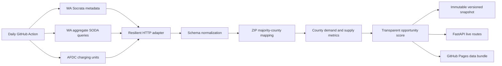

# ChargeForward Live data system

ChargeForward Live turns three official public feeds into a repeatable planning snapshot. It complements the repository's fixed historical model evaluation: the historical artifacts preserve reproducible evidence, while the live layer answers what the source systems report now.

## Sources and cadence

| Source | Dataset/API | Grain used | Published cadence | Current role |
|---|---|---|---|---|
| Washington State Department of Licensing | Electric Vehicle Population Data (`f6w7-q2d2`) | County aggregate and ZIP-to-county lookup | Monthly | Registered BEV/PHEV stock |
| Washington State Department of Licensing | Vehicle Registrations by Class and County (`hmzg-s6q4`) | Electric transactions by county-month | Monthly | Recent activity and year-over-year momentum |
| U.S. Alternative Fuels Data Center | EV charging-unit CSV | One operational public charging unit per row | Frequently refreshed inventory | Public station, port, connector, network, and coordinates |

Every refresh reads source metadata before it writes outputs. The source timestamps, reporting periods, statuses, row counts, and a deterministic source version travel with the result.

## Pipeline



The Socrata adapter requests server-side aggregates instead of downloading the full source tables. This lowers transfer volume while preserving the measures needed for the live product. The HTTP layer uses timeouts, retry with exponential backoff, explicit user-agent headers, a portable CA bundle, and typed upstream errors.

## County metrics

| Field | Definition |
|---|---|
| `EV_Stock` | Current Washington BEV and PHEV records assigned to the county |
| `Recent_EV_Transactions` | Sum of electric registration transactions in the latest 12 published months |
| `Prior_EV_Transactions` | Same measure for the preceding 12 months |
| `Registration_Growth_Pct` | Percentage change between those two periods |
| `Public_Stations` | Distinct operational public AFDC station IDs mapped to the county |
| `Public_Ports` | Charging units that can serve vehicles simultaneously |
| `DC_Fast_Ports` | Units with CCS/CHAdeMO, or J3400/J3271 units with recorded power of at least 50 kW |
| `EVs_Per_Port` | Registered EV stock divided by mapped public ports |
| `DC_Fast_Share_Pct` | DC-fast-capable units divided by public ports |
| `Opportunity_Score` | Weighted percentile screening score from 0 to 100 |

### Opportunity score

The score combines four within-Washington percentile signals:

| Component | Weight | Rationale |
|---|---:|---|
| Demand and activity | **40%** | Average percentile of EV stock and latest 12-month registration activity |
| Supply gap | **30%** | Percentile of registered EVs per mapped public port |
| Momentum | **20%** | Percentile of year-over-year registration growth, winsorized at the 5th and 95th percentiles |
| Fast-charging gap | **10%** | Percentile of the inverse DC-fast share |

This is an explainable screening index, not a causal model or a final siting recommendation. The website lets users replace the composite ranking with raw EVs-per-port or growth rankings and inspect the underlying county fields.

## Outputs

Local refreshes write these products beneath `data/live/`:

```text
data/live/
├── current/
│   ├── live_summary.json
│   ├── source_status.json
│   ├── county_live_metrics.csv
│   └── charging_stations.csv
└── snapshots/<source-version>/
    └── same four products
```

`data/live/` is runtime state and stays out of Git. The compact browser artifact, `assets/live-data.js`, is versioned because GitHub Pages serves static files. A refresh does not rewrite that file when the upstream version is unchanged, so the scheduled workflow creates commits only for real source changes.

Run a refresh locally:

```bash
export NLR_API_KEY=your_api_key
python scripts/refresh_live_data.py
```

`SOCRATA_APP_TOKEN` is optional but increases Socrata request limits. AFDC requires `NLR_API_KEY`; the scheduled workflow can use the public `DEMO_KEY` fallback, while a repository secret is recommended for reliable automation.

## API routes

| Route | Response |
|---|---|
| `GET /live/status` | Version, source freshness, state totals, and methodology |
| `GET /live/counties` | Ranked metrics for all Washington counties |
| `GET /live/counties/{county}` | Current metrics for one case-insensitive county name |
| `GET /live/stations?county=King` | Mapped public stations, optionally filtered by county |

## Interpretation limits

- Registration transactions are authorization events and can include repeat activity. They are a flow measure and must not be added to the current vehicle-stock measure.
- AFDC status is an inventory record. It does not report current occupancy, queue time, uptime, price, or delivered charging speed.
- ZIP codes can cross county boundaries. The current station mapping uses the county with the most EV records in each ZIP, so boundary stations require geospatial verification.
- The score ranks relative conditions among Washington counties. It does not measure site economics, electric-grid headroom, traffic exposure, parcel availability, disadvantaged-community benefit, or future station utilization.
- Source timestamps describe publication freshness. They do not imply that every underlying record was observed at that moment.

## Next analytical extension

The strongest next version would replace ZIP mapping with county boundary point-in-polygon joins, add traffic counts and utility hosting capacity, estimate charger utilization with observed sessions, and evaluate a learning-to-rank model against completed station performance. The current schema and versioned snapshots provide the time series needed to begin that work without rewriting the serving layer.
