# ChargeForward: project and analytics summary

**Scope:** Washington electric vehicle fleet analytics, county registration transaction forecasting, range data quality, and county segmentation.  
**Data snapshot:** user-supplied CSV files analyzed September 16, 2026.  
**Geography:** 39 Washington counties.  
**Repository:** [ChargeForward](https://github.com/cr-shah/chargeforward-ev-analytics).

## Executive summary

ChargeForward rebuilds an original EV analytics notebook as a reproducible Python project. It retains the comparison of EV fleet stock with registration activity, range cleaning, a second-degree polynomial forecast, a 200-mile scenario, and three county segments. It adds chronological model evaluation, statistical count models, tree-based ML, uncertainty intervals, feature ablation, county error diagnostics, a Streamlit dashboard, a FastAPI service, Docker packaging, and GitHub Actions tests.

The strongest historical **one-month-ahead county** result was a Poisson generalized linear model (GLM): **RMSE 92.95**, **MAE 31.20**, **WAPE 11.70%**, and **R² 0.9546** on 468 county-month observations from August 2025 through July 2026. This was a **10.3% lower RMSE** than the prior-year seasonal baseline (103.59). The 12-month **statewide** task was substantially harder: the polynomial model selected on earlier validation folds had RMSE 1,940.90 and R² -1.5171 in that same final year, while a simple seasonal baseline had RMSE 1,242.82. These are historical evaluations, and the final period had been inspected in earlier project versions; they are not prospective performance guarantees.

> **Measurement boundary:** The registration data count transactions associated with authorizing vehicles for road use. A transaction is not necessarily a new vehicle purchase. The project has no charger inventory, so it cannot quantify charger supply, a charging infrastructure gap, or charger demand directly.

## Data and analytical units

| Source | What it contributes | Cleaning and aggregation |
|---|---|---|
| [Electric Vehicle Population Data](https://catalog.data.gov/dataset/electric-vehicle-population-data) | Current BEV/PHEV fleet snapshot, make/model/year, reported electric range, vehicle location | Keep `State = WA` and the 39 Washington counties; deduplicate by DOL vehicle ID; derive county fleet counts and range coverage. |
| [Vehicle Registrations by Class and County](https://catalog.data.gov/dataset/vehicle-registrations-by-class-and-county) | Transactions by date, residential county, fuel type, and count | Parse transaction month; aggregate `Fuel Type = Electric` by residential county and month. `Hybrid` is excluded from the electric target. |

| Measure | Observed result | Interpretation |
|---|---:|---|
| Unique WA EVs in the fleet snapshot | **298,916** | Current stock, counted once per DOL vehicle ID. |
| Counties | **39** | All WA counties represented. |
| Electric registration transactions, Jan 2017–Jul 2026 | **576,457** | Flow over time; repeat transactions may occur. |
| Electric transactions, Aug 2025–Jul 2026 | **124,834** | Latest complete 12-month window in the supplied files. |
| Positive observed electric ranges | **103,142 / 298,916 (34.5%)** | Measured-range analysis covers a minority of vehicles. |
| Historical final county evaluation rows | **468** | 39 counties × 12 months. |

Fleet stock and transaction flow describe different quantities and should not be added together. The population CSV is a current snapshot, so it is **excluded from historical forecasting features** to avoid using future information. See the [leakage audit](LEAKAGE_AUDIT.md).

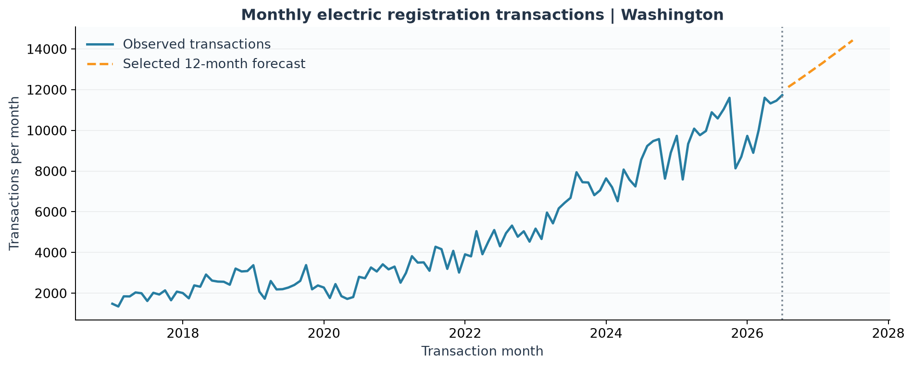

## Technology stack

| Layer | Tools | Role in the project |
|---|---|---|
| Language and tabular processing | Python 3.10+, pandas, NumPy | CSV ingestion, cleaning, monthly aggregation, feature engineering, metrics. |
| Machine learning | scikit-learn | Linear/polynomial/Ridge regression, Random Forest, Histogram Gradient Boosting, K-Means, standardization, silhouette scoring. |
| Statistical modeling | statsmodels | Poisson and Negative Binomial GLMs for county transaction counts. |
| Model artifacts | joblib | Save fitted panel and statewide estimators locally. |
| Visualization | Matplotlib, Plotly, Folium, streamlit-folium | Published figures, interactive plots, county map markers. |
| Application | Streamlit, FastAPI, Uvicorn | County and threshold exploration; read-only forecast and evaluation endpoints. |
| Packaging and quality | setuptools, Docker, unittest, GitHub Actions | Installable package, API container, regression tests, CI on pushes and PRs. |

This is **classical machine learning and statistical modeling**, not an LLM or generative-AI system. It does not use XGBoost, GeoPandas, a cloud database, or live Data.gov ingestion. The dashboard map uses Folium markers based on median vehicle coordinates per county; those coordinates are neither charger sites nor official county centroids.

## End-to-end analytical workflow

1. **Ingest and audit:** Read the two CSVs, filter to Washington counties, deduplicate EV IDs, parse dates and counts, and record source-row and coverage statistics.
2. **Handle range missingness:** Treat zero or missing range as unobserved. Create separately flagged display estimates using medians in the order make/model/year → make/model → EV type → overall observed median. Threshold statistics use **observed positive ranges only**, not imputed values.
3. **Build monthly targets:** Sum electric registration transactions for each county-month and statewide month. Build a complete county-month grid for lag features; absent combinations are filled with zero by the current pipeline.
4. **Engineer past-only predictors:** Prior-month and prior-year counts, shifted rolling averages, year-over-year gap, county historical scale, time index, and cyclic month features. Current-month targets and current EV fleet attributes do not enter historical forecasts.
5. **Validate chronologically:** Select models using earlier periods, refit before the historical final year, then compare all candidates on the same August 2025–July 2026 rows. Repeat selected comparisons across six annual windows.
6. **Diagnose results:** Compare pooled and county-level errors, run validation-only feature ablation, test interval coverage, examine observed range missingness, and vary the range threshold and cluster count.
7. **Serve and present:** Save CSV/JSON/model outputs locally, publish compact result tables and figures, expose read-only FastAPI endpoints, and support interactive county and range-scenario exploration in Streamlit.

## ML and statistical methods

| Method | Task | Why it was included |
|---|---|---|
| Seasonal naive / prior-year month | Statewide 12-month and county next-month baselines | Tests whether complexity beats repeating the same month from the prior year. |
| Linear regression | Statewide 12-month forecast | Simple trend benchmark. |
| Degree-2 polynomial regression | Statewide 12-month forecast | Preserves the original notebook approach and tests a curved trend. |
| Seasonal Ridge regression | Statewide 12-month forecast | Regularized trend plus month indicators. |
| Random Forest and Histogram Gradient Boosting | Both forecasting tasks | Nonlinear ML alternatives with calendar and observed historical activity. |
| Poisson GLM | County next-month count forecast | Count-specific log-link model with lags, county effects, time, and seasonality. |
| Negative Binomial GLM | County next-month count forecast | Tests whether explicitly modeling overdispersion improves predictions. |
| K-Means, `k=3` | Descriptive county segmentation | Preserves three interpretable groups from the original project. |
| Split-conformal absolute-residual intervals | County next-month uncertainty | Checks empirical coverage rather than reporting point forecasts alone. |

The Poisson and Negative Binomial models use log-transformed lag counts, county effects, month indicators, and a time index. Negative Binomial dispersion is estimated from training-only Poisson residual moments. The count target was overdispersed in training: mean **103.69**, variance **59,430.93**, and median within-county variance/mean **11.02** (38 of 39 counties above 1). That motivated testing Negative Binomial; it did **not** make Negative Binomial the best forecaster.

## Forecasting results

### A. Statewide 12-month forecast

The project compares six methods across three expanding-window, 12-month validation folds. The lowest mean validation RMSE selects the model; all methods are then scored on the historical final year. The selected method is refit on all observed months to produce an **exploratory August 2026–July 2027 projection**.

| Model | Earlier mean RMSE ↓ | Historical final RMSE ↓ | Final R² | Final WAPE |
|---|---:|---:|---:|---:|
| Polynomial degree 2 **(selected)** | **675.26** | 1,940.90 | -1.5171 | 15.64% |
| Random Forest | 1,583.03 | 1,306.94 | -0.1413 | 11.30% |
| Histogram Gradient Boosting | 1,772.33 | 1,372.13 | -0.2580 | 11.83% |
| Linear regression | 1,846.80 | 1,624.18 | -0.7626 | 13.76% |
| Seasonal Ridge | 1,853.16 | 1,619.25 | -0.7519 | 13.67% |
| Seasonal naive | 1,854.13 | **1,242.82** | **-0.0321** | **10.46%** |

**Significance:** The polynomial curve looked strongest on earlier folds but generalized poorly to the final year. Every final R² is negative, so the 12-month extension should be shown as a scenario, not described as an accurate production forecast. The model ranking also demonstrates why a naive benchmark and a time-ordered final comparison matter.

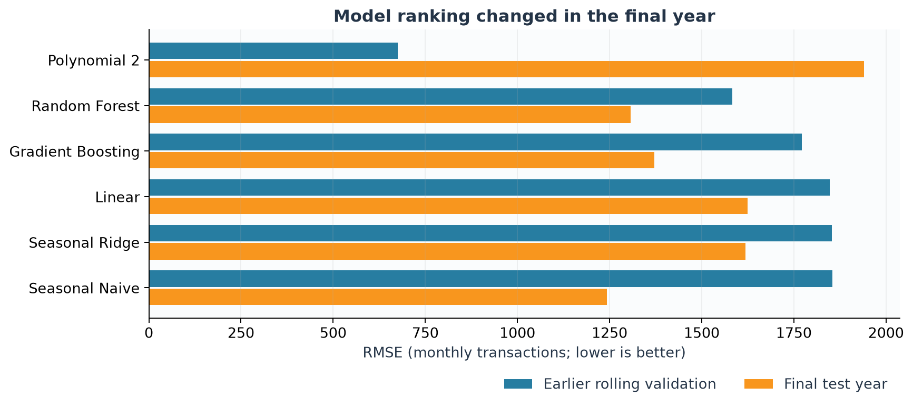

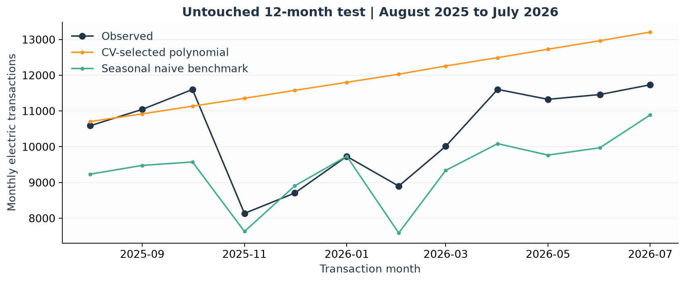

### B. County one-month-ahead forecast

Training ends **July 2024**, validation covers **August 2024–July 2025**, and the historical final evaluation covers **August 2025–July 2026**. The target is the count for each county's next month, using observed data available before that month. RMSE and MAE are in monthly transactions per county; lower is better. WAPE is total absolute error divided by total observed transactions; R² measures fit relative to a mean predictor on these rows.

| Model | Validation RMSE ↓ | Historical final RMSE ↓ | Final MAE ↓ | Final WAPE ↓ | Final R² |
|---|---:|---:|---:|---:|---:|
| Prior-year month baseline | 157.10 | 103.59 | 44.20 | 16.57% | 0.9436 |
| **Poisson GLM** | **42.73** | **92.95** | **31.20** | **11.70%** | **0.9546** |
| Negative Binomial GLM | 89.45 | 136.94 | 49.20 | 18.44% | 0.9014 |
| Random Forest | 73.54 | 132.57 | 45.28 | 16.98% | 0.9076 |
| Histogram Gradient Boosting | 87.82 | 132.29 | 47.99 | 17.99% | 0.9080 |

**Significance:** Poisson had the lowest pooled final RMSE, improving on the prior-year baseline by **10.64 transactions, or 10.3%**, with **13.00 fewer MAE transactions (29.4%)** and **4.87 percentage points lower WAPE**. Neither tree model beat the baseline on pooled final RMSE. Poisson's error also rose from **42.73** on validation to **92.95** on the later period, so the performance level is not stable across years.

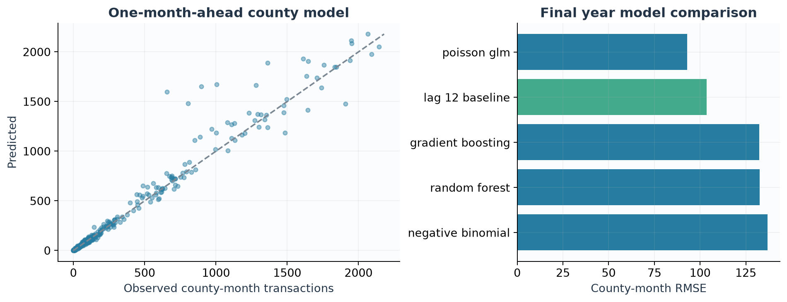

### C. County heterogeneity and error analysis

Random Forest beat the seasonal baseline by RMSE in **34 of 39 counties**, but lost or tied in five. A large King County miss (**-148.1% relative RMSE improvement**) outweighed many small-county gains in pooled RMSE. The comparison changes with the aggregation: Random Forest had the lowest **median county MAE**, while Poisson had the lowest pooled MAE and median county WAPE.

| Error view | Prior-year baseline | Poisson GLM | Random Forest |
|---|---:|---:|---:|
| Pooled county-month RMSE ↓ | 103.59 | **92.95** | 132.57 |
| Pooled county-month MAE ↓ | 44.20 | **31.20** | 45.28 |
| Median county MAE ↓ | 18.67 | 10.79 | **9.03** |
| Median county WAPE ↓ | 21.88% | **12.55%** | 13.09% |

County size and Random Forest percentage improvement had almost no rank association (**Spearman ρ = 0.027, p = 0.870**). Larger absolute year-over-year changes were associated with more Random Forest error reduction relative to the baseline (**Spearman ρ = 0.491**); this is a descriptive association, not causal evidence. The [full county error table](results/county_error_analysis.csv) and [county-month diagnostic rows](results/error_diagnostics.csv) support deeper inspection.

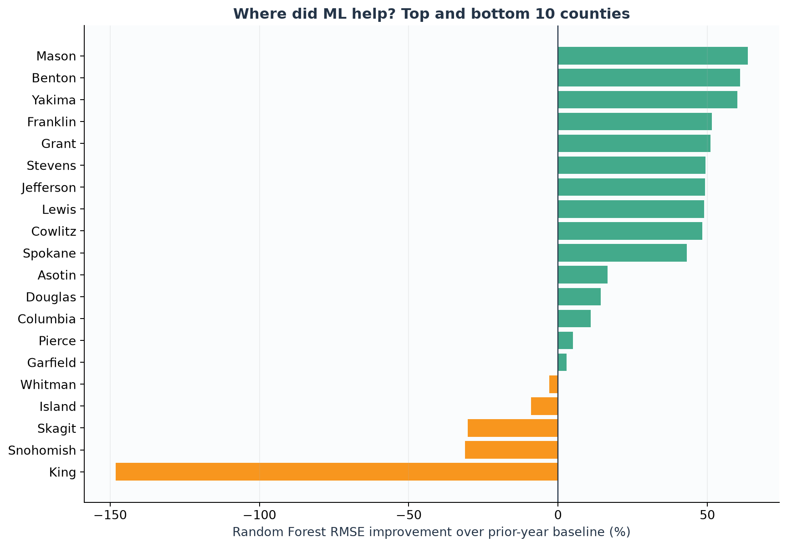

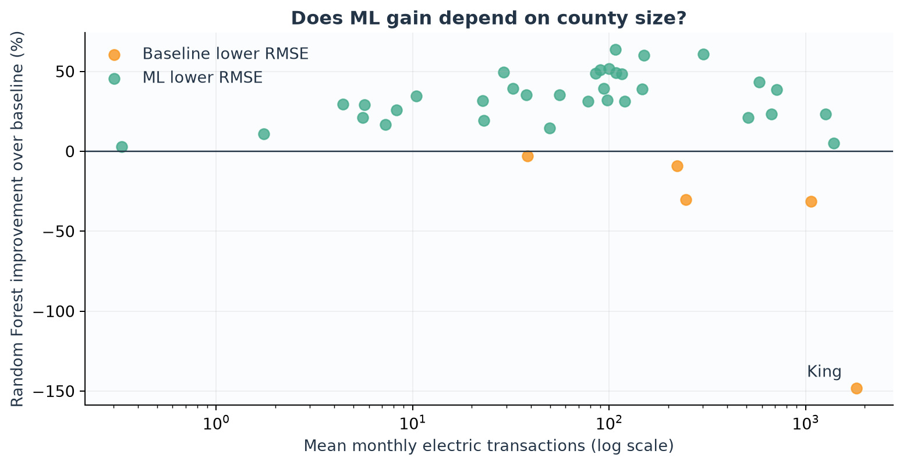

### D. Feature ablation

Six cumulative Random Forest feature sets were compared on **validation only**. The final historical year was not used to choose these groups.

| Feature set | Validation RMSE ↓ | Interpretation |
|---|---:|---|
| Calendar and time only | 449.10 | Seasonality and trend alone miss most county-level variation. |
| Add prior-year month | 98.30 | A **350.80** transaction RMSE reduction versus calendar only. |
| Add prior month | 86.00 | Recent activity adds signal. |
| Add shifted trailing averages | 75.24 | Local level and trend further improve validation. |
| Add historical county scale | 75.22 | Little additional gain in this cumulative ordering. |
| Full past-only feature set | **73.54** | Best RMSE of these tested groups on validation. |

**Significance:** The matching month from the prior year is especially informative. The ablation is conditional on the Random Forest model, this validation window, and the order in which feature groups were added; it is not a causal feature-importance estimate.

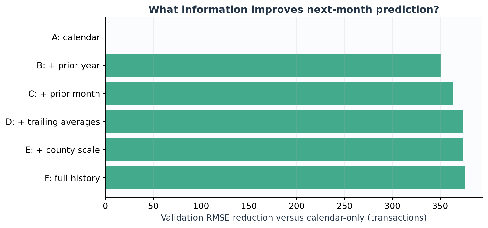

### E. Prediction intervals and stability

An interval experiment selects a model on 2023–24 data, trains through July 2024, calibrates absolute residuals on 2024–25, and evaluates on 2025–26. Finite-sample split-conformal quantiles are computed separately for three county-volume groups defined before calibration.

| Interval target | Observed final coverage | Mean width, transactions | Reading |
|---|---:|---:|---|
| 80% | **75.9%** | 84.53 | Undercovered by about 4.1 percentage points. |
| 95% | **90.0%** | 212.24 | Undercovered by about 5.0 percentage points. |

Coverage was lower in medium- and high-volume groups, especially high-volume counties at the 95% target (**87.2%**). These intervals should not be presented as calibrated guarantees; temporal change may weaken the assumptions needed for coverage. See the [coverage breakdown](results/interval_coverage.csv).

Across six successive August–July historical windows, Poisson had the lowest RMSE in **four**, Random Forest in **two**. In the last window, actual electric transactions rose **11.27% year over year**, and the seasonal baseline narrowed the performance gap. The [annual results](results/temporal_robustness.csv) show model rankings vary with the period, without establishing a single cause.

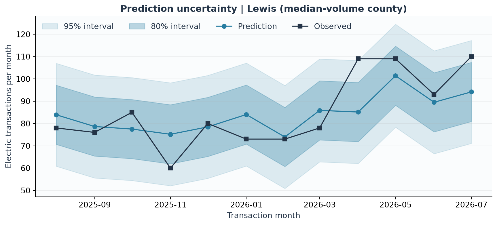

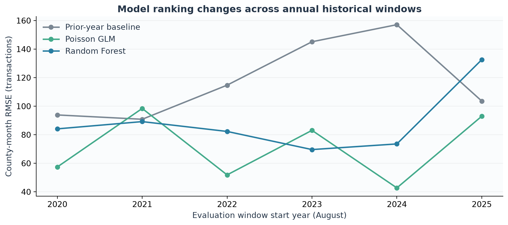

## Descriptive EV and range analytics

### County stock and transaction activity

| County | EVs in current fleet | Electric transactions, latest 12 months | Positive observed-range coverage |
|---|---:|---:|---:|
| King | 144,257 | 21,776 | 32.0% |
| Snohomish | 37,818 | 12,822 | 29.6% |
| Pierce | 25,042 | 16,658 | 36.0% |
| Clark | 18,782 | 15,175 | 37.3% |
| Thurston | 10,985 | 8,015 | 38.7% |
| Kitsap | 10,351 | 8,549 | 39.3% |

**Significance:** King has by far the largest EV fleet, but recent transaction activity is more distributed among counties. The two measures capture a snapshot and a time-based flow, respectively.

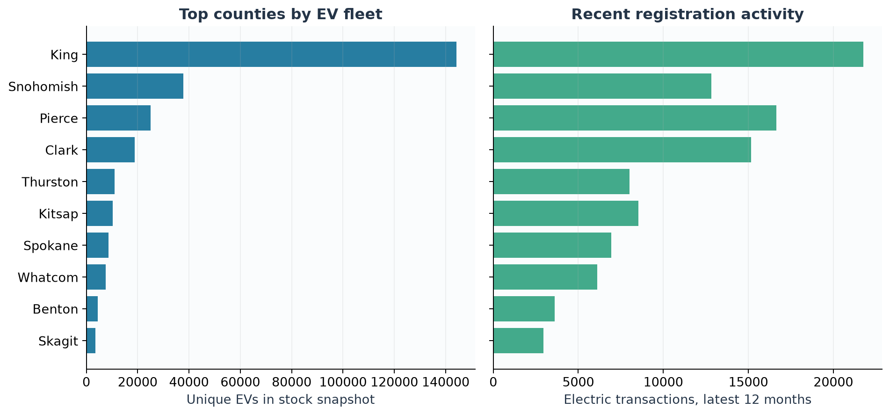

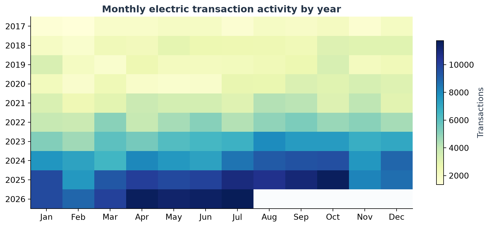

### Electric range missingness and threshold sensitivity

Only **34.5%** of WA fleet records have a positive observed range. Coverage is **18.8% for BEVs** and **99.9% for PHEVs**, and varies by model year: it is near complete for 2015–20 but **24.5% for 2021** and **12.0% for 2023**. The observed pattern does not, by itself, establish a missingness mechanism.

| Threshold | All measured EVs below | Measured BEVs below | Measured PHEVs below |
|---|---:|---:|---:|
| 150 miles | 66.21% | 23.22% | 99.98% |
| 200 miles | **68.80%** | **29.09%** | **100.00%** |
| 250 miles | 90.65% | 78.75% | 100.00% |
| 300 miles | 97.41% | 94.12% | 100.00% |

**Significance:** The pooled 200-mile share is dominated by measured PHEVs, whose reported electric-only ranges are much shorter than BEV driving ranges. It is a **share of records with measured range below a cutoff**, not a measure of charger access or demonstrated “range anxiety.” Zero range is treated as missing, not as a zero-mile vehicle. The [missingness table](results/range_missingness_analysis.csv) and [threshold sensitivity table](results/range_threshold_sensitivity.csv) retain counts and denominators.

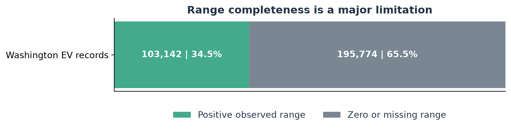

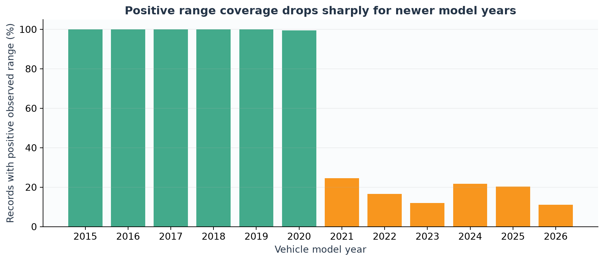

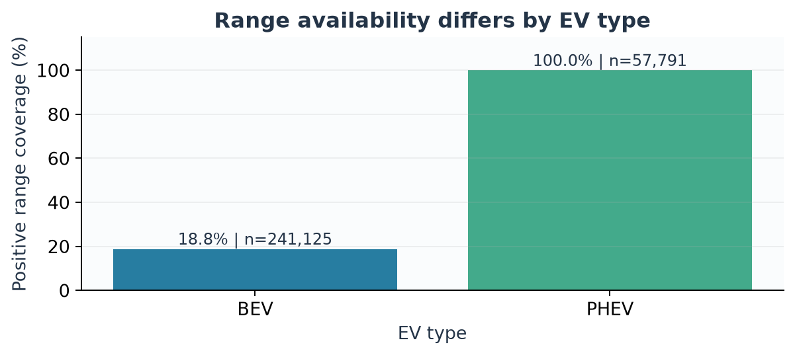

### K-Means county segments

Counties are clustered on **log EV fleet size**, **log recent 12-month electric transactions**, and **the share of positive observed ranges below 200 miles**. Features are standardized before K-Means. Cluster IDs are renamed by median fleet size as Emerging, Growth, and Established. “Growth” is a relative size label, **not** a claim that its counties have the highest growth rate. The Streamlit slider refits the clustering as the threshold changes from 50 to 350 miles.

| Segment | Counties | EVs in stock | Latest 12-month electric transactions | Median measured share below 200 miles |
|---|---:|---:|---:|---:|
| Emerging | 7 | 798 | 642 | 62.5% |
| Growth | 14 | 11,873 | 9,225 | 75.1% |
| Established | 18 | 286,245 | 114,967 | 68.3% |

The three-cluster silhouette score is **0.339**. Among tested values `k=2…8`, **k=2 scored highest at 0.423**. The project retains three segments for continuity with the original analysis and practical comparison, not because three is mathematically optimal or represents natural categories. These descriptive groups do not establish charging need or policy priority. See [cluster sensitivity](results/clustering_sensitivity.csv).

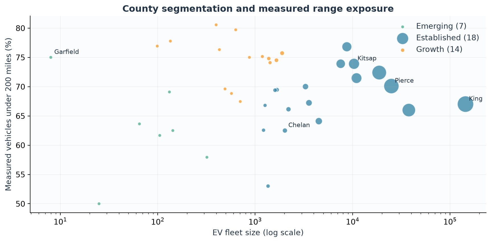

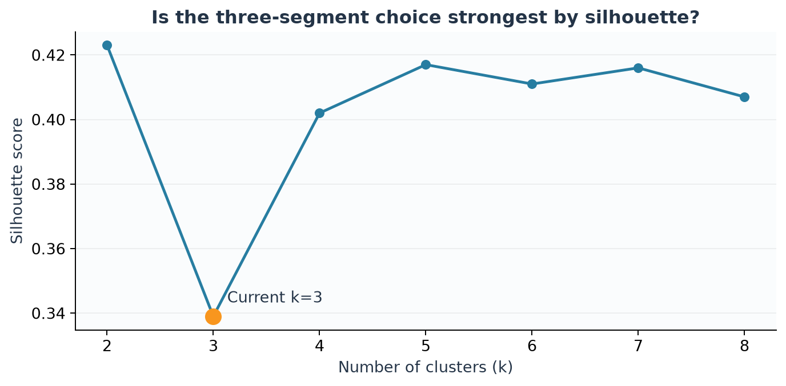

## Delivery, reproducibility, and limits

- **Artifacts:** The pipeline writes cleaned tables, forecast CSVs, model files, and `evaluation.json` to `data/processed/`; selected compact result tables are committed under [`docs/results/`](results/). Figures are committed under [`docs/figures/`](figures/).
- **Dashboard:** Streamlit supports county selection, historical and exploratory forecast views, evaluation tables, range-threshold slider, and Folium segment map.
- **API:** FastAPI exposes `/health`, `/counties`, `/forecast/{county}`, `/forecast/statewide`, and `/evaluation`. Readiness checks for the files required by the served endpoints.
- **Quality:** `unittest` checks ingestion, time splits, feature availability, leakage, uncertainty quantiles, and API readiness; GitHub Actions runs tests on push and pull request. `scripts/verify_report.py` checks report artifacts after a fresh local pipeline run.
- **Container:** Docker packages the API with already-generated processed artifacts; it does not fetch or refresh data automatically.

**Limits to communicate clearly:** the source CSVs are a snapshot; registration counts can include repeat transactions; absent county-month combinations are filled with zero by the panel builder; range coverage is selective; the 2025–26 final period was inspected in earlier project versions; forecast rankings and interval coverage changed over time; and there is no charger inventory or causal study. The strongest claim is a **reproducible, carefully evaluated historical analytics pipeline**, not a validated charging-supply recommendation.

## Concise project description for a portfolio

> Built a reproducible Washington EV analytics pipeline covering **298,916 fleet records**, **576,457 electric registration transactions**, and **39 counties**. Compared seasonal baselines, linear and polynomial models, Poisson/Negative Binomial GLMs, Random Forest, and Gradient Boosting with chronological evaluation. A Poisson GLM achieved the lowest historical final county-month RMSE (**92.95**, versus **103.59** for the seasonal baseline); additional work assessed county error heterogeneity, past-only feature contribution, interval undercoverage, range-data missingness, and K-Means segment sensitivity. Delivered results through a Streamlit dashboard, FastAPI, Docker, CI, and published figures and tables.

## Source files for every reported result

- [Main README](../README.md) — visual overview and run instructions.
- [Detailed research notes](RESEARCH_RESULTS.md) — experiment design and additional interpretation.
- [Leakage audit](LEAKAGE_AUDIT.md) — feature timing and final-period caveat.
- [Model comparison](results/statistical_model_results.csv), [state and county evaluation JSON](results/evaluation.json), [county errors](results/county_error_analysis.csv), [macro metrics](results/macro_metrics.csv).
- [Feature ablation](results/ablation_results.csv), [interval coverage](results/interval_coverage.csv), [temporal robustness](results/temporal_robustness.csv).
- [Range missingness](results/range_missingness_analysis.csv), [threshold sensitivity](results/range_threshold_sensitivity.csv), [cluster sensitivity](results/clustering_sensitivity.csv).
